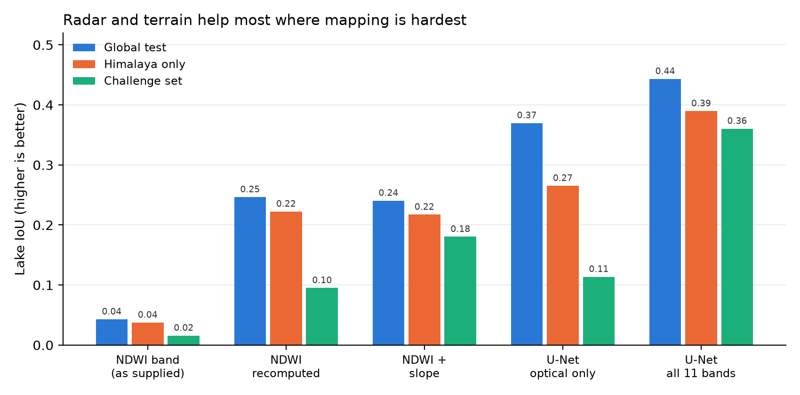

# Mapping glacial lakes with deep learning: how far do we get beyond a water index?

A small, reproducible study on the global [Glacial-Lake-Bench](https://doi.org/10.5194/essd-2026-474) dataset, with a separate score for the **Himalaya**. It asks three simple questions:

1. How good is the classic NDWI water index on its own?
2. How much does a U-Net trained on 11 bands (optical + DEM + radar) add?
3. Which inputs matter: does radar help under clouds, and does terrain help with shadows?

This is Task 1 of my PhD preparation plan. It is the first step towards a volume-aware, multi-sensor glacial lake observatory for GLOF early warning in the Himalaya.

## Data

Glacial-Lake-Bench (Kaushik et al., 2026) contains 19,115 image chips (256 × 256 px, 10 m) from every glacier region except Antarctica. Each chip has 11 bands: six Sentinel-2 optical bands, NDWI, slope and elevation from the Copernicus DEM, and Sentinel-1 VV/VH radar. The **challenge set** (1,105 chips) collects the hard cases: clouds, shadow, frozen lakes and lakes smaller than 0.05 km².

To keep things laptop-sized I use a reproducible subset (`data/glb_subset/manifest.csv`):

| Split | What is included |
|---|---|
| train / val | 20% of chips from every region, drawn at random with a fixed seed |
| test | all Himalayan chips (SA, SAW) + 25% of the other regions |
| challenge | the full challenge set |

Note: every band is rescaled to 0–1 within each chip by the dataset authors, so the textbook rule "NDWI > 0 means water" does not apply directly. The NDWI threshold is therefore learned from the training chips.

## How to run

```bash
python -m venv .venv && source .venv/bin/activate
pip install -r requirements.txt

python src/download_subset.py                 # ~10 GB subset, no need to fetch the 44 GB zip
python src/ndwi_baseline.py                   # baseline 1: water index
python src/train_unet.py --epochs 30          # baseline 2: U-Net, all 11 bands
python src/train_unet.py --epochs 30 --bands optical   # what if we only had Sentinel-2?
python src/score_checkpoint.py checkpoints/unet_all.pt # re-score a saved model
python src/plot_results.py                    # the comparison figure
```

Results land in `results/` (a summary JSON and a per-chip CSV for every method). `notebooks/01_explore_and_results.ipynb` walks through the data and the results with figures.

## Results



**Lake IoU** (strict: lake class only, averaged per chip). The paper-style two-class mIoU (lake + background, their equation 1) is in brackets.

| Method | Global test | Himalaya | Challenge |
|---|---|---|---|
| NDWI band, as supplied | 0.04 (0.47) | 0.04 (0.45) | 0.02 (0.42) |
| NDWI recomputed from Green/NIR | 0.25 (0.61) | 0.22 (0.60) | 0.10 (0.52) |
| NDWI recomputed + slope | 0.24 (0.60) | 0.22 (0.59) | 0.18 (0.57) |
| U-Net, optical bands only | 0.37 (0.67) | 0.27 (0.62) | 0.11 (0.54) |
| **U-Net, all 11 bands** | **0.44 (0.71)** | **0.39 (0.68)** | **0.36 (0.66)** |
| *Paper: U-Net, full data, 100 epochs* | *(0.82)* | – | *(0.76)* |
| *Paper: Prithvi, full data* | *(0.85)* | – | *(0.79)* |

What I take from this:

1. **Check the data before trusting a ready-made index.** The supplied NDWI band barely separates lakes from their surroundings (median 0.56 on lakes vs 0.62 elsewhere, because every band is stretched 0–1 per chip). Recomputing NDWI from the Green and NIR bands fixes most of this.
2. **Deep learning clearly beats simple rules,** by nearly double the lake IoU on the global test set.
3. **Radar and terrain matter most where mapping is hardest.** Adding Sentinel-1 and DEM bands lifts lake IoU only modestly across all regions (0.37 → 0.44) but more than triples it on the challenge set (0.11 → 0.36). Without terrain, the U-Net loses to the simple NDWI + slope rule on hard scenes.
4. **The central–eastern Himalaya is the hardest region in the benchmark.** South Asia East (SA) has the lowest score of all 17 regions (two-class mIoU 0.64 with all bands, 0.51 with optical only). South Asia West sits near the average (0.73).
5. **Metric definitions matter.** "mIoU" in the paper averages lake and background IoU. The same model scores 0.44 on lake IoU but 0.71 on two-class mIoU. Re-weighting our test set to the paper's regional mix gives 0.725, against the paper's 0.82 with five times more training data and more than three times the epochs.

## Honest caveats

- I train on 20% of the data, so the numbers are a lower bound compared with the paper's full-data runs.
- Our test set deliberately over-represents the Himalaya (351 of 740 chips, against about 18% in the full test set), so our global numbers are harder than the paper's.
- The NDWI thresholds are tuned on 800 training chips; re-tuning on different chips shifts the rule scores slightly (about ±0.04 lake IoU).
- Almost every chip (about 99%) contains a lake, so the choice of how to score empty chips hardly matters here.
- The standard test split is random, so neighbouring chips can land in both train and test. A region-held-out test is the next experiment.

## Reference

Kaushik, S., Tellman, B., Howat, I., & Haritashya, U. (2026). Glacial-Lake-Bench: A global multi-sensor benchmark dataset for evaluating deep learning models for glacial lake mapping. *Earth System Science Data Discussions*. https://doi.org/10.5194/essd-2026-474. Data: https://zenodo.org/records/17917359 (CC BY 4.0).

## Licence

Code: MIT (see `LICENSE`). The Glacial-Lake-Bench data are not redistributed here; they are CC BY 4.0 from Zenodo and `src/download_subset.py` fetches them.

## Author

Milan Samal
